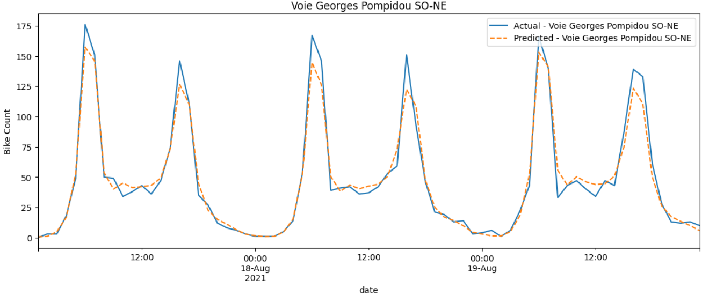
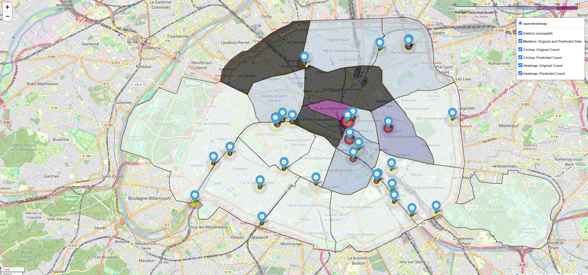

# 🚴‍♂️ Bike Counters Paris Project


Welcome to the **Paris Bike Count Analysis** project! This repository analyzes bicycle traffic 🚴‍♀️🚴‍♂️ in Paris using historical data and external sources (weather ☁️, accidents 🚧, COVID-19 🦠) to predict bike counts across different locations in the city.

## 📁 Project structure

```bash
.
├── data
        ├── train.parquet                                    # Original training data
        ├── test.parquet                                     # Original test data
        ├── external_data.csv                                # Weather data
        ├── road accident                                    # Road accident data
            ├── ...
        ├── bike_map                                         # Map bike data
            ├── ...
        ├── table-indicateurs-open-data-dep-2023-COVID.csv   # COVID data
├── img                                                        
├── deliverables                                              
        ├── Alexandre_Brun_Thomas_Bordes_bike_count_2023.pdf # Final repport
        ├── Bikes_data_strategy.pdf                          # What data are used and why
        ├── Presentation.pptx                                # Power Point Final presentation
        ├── paris_map_combined.html                          # Map that illustrates predicted bike count over real bike count
├── submissions                                              # Code to push results on Kaggle
        ├── ...       
├── utils                
        ├── get_data.py                                      # Python code for merging external data 
├── Bikes_data_strategy.pdf                                  # Overview of the metadata for each dataset and initial strategy discussions.

├── Training_model.ipynb                                     # End-to-end model training, data merging, preprocessing, and result visualization.
├── Training_model_pipeline_final.ipynb                      # Pipeline for the best-performing model.
├── bike_counter_map.ipynb                                   # Create map to illustrate bike count original and predicted.
```

## ✨ Features

- 🍃 Data Merging: Combine multiple external datasets (weather ☀️, accidents 🚧, etc.) to enhance bike count predictions.
- 🧠 Model Training: Train machine learning models using scikit-learn, XGBoost, and others to predict bike counts 🚴‍♂️.
- 📊 Prediction Visualization: Generate detailed visualizations 📈 for bike count predictions with **folium**.

## 🚀 Quick Start

Follow these instructions to get the project up and running on your local machine.

### 1. Clone the repository:

```bash
git clone https://github.com/ThomasBrdes/bike-count-DSB.git
cd bike-count-DSB
```

### 2. Install env:

```bash
conda env create -f environment.yml
conda activate bikes-count
```

### 3. Launch Jupyter:

```bash
jupyter notebook
```

### 4. Launch the training code with notebook [Training_model.ipynb](Training_model.ipynb)

### 5. Create the bike count map with notebook [bike_counter_map.ipynb](bike_counter_map.ipynb)

This gives [paris_map_combined.html](submissions\paris_map_combined.html).

## 📸 Bike count prediction example

We can visualize the bike count prediction on the `Voie Georges Pompidou SO-NE` here between the 17th August 2021 and 19th August 2021 as an example :



## 📸 Bike count map

The interactive map [paris_map_combined.html](submissions\paris_map_combined.html) visualizes the bike counters in Paris, showcasing average hourly bike counts across different districts. 🌆 It combines both circle markers and regular markers to highlight individual counter locations and uses a choropleth map to represent the overall bike count distribution across districts. 🌐

### 🛠️ **Features**
- 📊 **Choropleth Map**: Shows average hourly bike counts by district.
- 📍 **Circle Markers**: Separate circles for original (🟣 purple) and predicted (🟠 orange) counts.
- 📌 **Combined Markers**: Display both original and predicted counts when hovered over.
- 🔀 **Layer Controls**: Toggle between views - Choropleth, Original and Predicted Circle Markers, and Combined Info Markers.



## 📥 Download the Data

The data was downloaded from the links provided in [Bikes_data_strategy.pdf](deliverables/Bikes_data_strategy.pdf).

## 🛠️ Tech Stack

- **Python** 🐍: Programming language
- **scikit-learn - XGBoost** 🤖: For training and predictions.
- **Folium** 🖥️: Web framework for building web map

## 👥Authors

 - **Alexandre Brun** 🧑‍💻
**Thomas Bordes** 🧑‍💻

This project is part of the Python for Data Science course from the **X-HEC Master’s Program** 🏫.

## 📚 Acknowledgements

> 🔍 **Code for bike count map inspired by**: [Li-Hsiang Hsu](https://medium.com/@hsu.lihsiang.esth/bike-counts-in-paris-geospatial-considerations-0aaf312829c1) 
